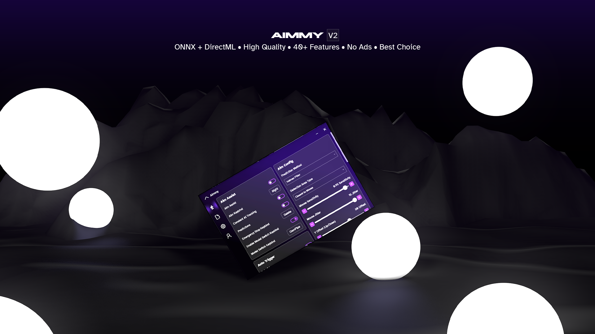

> [!NOTE]
> If you enjoy Aimmy, please consider giving us a star ⭐! We appreciate it! :)
  <p>
    <a href="https://aimmy.dev/" target="_blank">
      </a>
  </p>

Aimmy is a universal AI-Based Aim Alignment Mechanism developed by BabyHamsta, MarsQQ & Taylor to make gaming more accessible for users who have difficulty aiming.

> [!NOTE]
> **I highly recommend you to use TensorRT, if your gpu is older and doesn't have Tensor Cores (Check this by googling), I suggest trying CUDA and then comparing to the regular [aimmy](https://github.com/BabyHamsta/Aimmy)**.

> [!IMPORTANT]
> DOWNLOAD the **DLL INCLUDED**!!! There is **no** performance difference

> [!CAUTION]
> No, CUDA/TensorRT does **NOT** work on your **AMD/INTEL GPU!!!**

## What is TensorRT? 
@mastere4 says, *"Pretty much an add-on for CUDA. While it does make your gameplay smoother and faster, it's a double edge sword by making your models loading time drastically slower for 1st time instances."* 

## Comparison between TensorRT and CUDA
```diff
+ TensorRT has a 5-10ms difference for me.
+ TensorRT is guaranteed to optimize your model for better accuracy, and faster iteration times.
+ TensorRT optimizes a model and uses precision methods for accuracy.
+ TensorRT has a GPU Memory Limit
+ TensorRT has INT8 Precision and FP16 Precision.
- TensorRT Caching takes a lot of space if you are optimizing a lot of models.
- TensorRT takes way longer to load a model (for the 1st load), 384 - 60 seconds, but after caching, it'll take about 40-9 seconds.
- ONNXRuntime's caching system is difficult, being way slower than the DLL i have created, but no way to use my DLL in conjuction with ONNXRuntime.
- About 560MB, and extra installation (though quite simple)

+ CUDA model loadtimes are almost instantaneous
+ CUDA also has a GPU Memory Limit
+ CUDA can use TF32 as a Math Mode.
+ CUDA is 560MB less than the TensorRT installation
- CUDA does not have the optimizations that TensorRT provides
- CUDA is approximately 10-5ms slower than TensorRT
```

## How do I check my benchmarks?
Our benchmarks appear while using Debug Mode, which you will find in the settings tab. Turn it on **before** loading a model to get more information. After closing aimmy or by loading another model, inside **debug.txt** you will find a large text telling you
the _ms_ times for each function. The main one you should look at is most likely the AILoop Iteration Times, which is how long it takes to iterate through everything.

To get accurate Benchmarking times, play around a little in your favourite game with your favourite model. Use various confidences, etc.

## Optimization
While the new 2.4.x version of Regular DirectML Aimmy is great and optimized, it is better to use CUDA/TensorRT where you can. I am very proud of the improvement and performance changes I have done using OnnxRuntimes CUDA package.
I highly recommend any nvidia user to use CUDA unless their GPU/Benchmarking times prove that it is not worth so. But try it at least once.
You can look through my code as well and see for yourself if it has mem leaks, slow code, messy organization etc. (I will gladly fix it if you let me know)

Here are some documentation proving speed of ONNX's EP's:
- **[COMPARISON BETWEEN CUDA, DIRECTML, AND TENSORRT](https://nietras.com/2021/01/25/onnxruntime/#:~:text=some%20warmup%20before.-,Execution%20Provider,1.56,-DirectML)** ⭐⭐⭐⭐⭐
- [ONNX DOC](https://onnxruntime.ai/docs/execution-providers/TensorRT-ExecutionProvider.html#:~:text=With%20the%20TensorRT%20execution%20provider%2C%20the%20ONNX%20Runtime%20delivers%20better%20inferencing%20performance%20on%20the%20same%20hardware%20compared%20to%20generic%20GPU%20acceleration.)
- [COMPARISON ARTICLE](https://medium.com/@sundarbalamurugan/comparision-between-tensorrt-pytorch-onnx-runtime-2842bd208d73)

Beware of credibility. 

## Need help?
> [!IMPORTANT]
> [CHECK THE WIKI!](https://github.com/TaylorIsBlue/Aimmy-CUDA/wiki)


Before reaching out, make sure you have the **DLL-INCLUDED**, you will know because the zip file will say that it is dll-included.

Also, please check the [WIKI](https://github.com/TaylorIsBlue/Aimmy-CUDA/wiki), it has all the answers to 99.99% of your problems.

Aimmy will let you know if your aimmy won't work at startup, if the cuda files are missing, tensorrt files are missing, etc.

This is also just the same as Regular Aimmy, you need the basic dependencies.

To run Aimmy you first need all of the dependencies which are 
- [.NET v7](https://download.visualstudio.microsoft.com/download/pr/e8b0aac4-7f86-4a7b-9a9a-448aa2b0f116/99a4178751b799db3d059b4b22b4451e/windowsdesktop-runtime-7.0.18-win-x64.exe)
- [.NET v8](https://download.visualstudio.microsoft.com/download/pr/c1d08a81-6e65-4065-b606-ed1127a954d3/14fe55b8a73ebba2b05432b162ab3aa8/windowsdesktop-runtime-8.0.4-win-x64.exe)
- [VCRedist](https://aka.ms/vs/17/release/vc_redist.x64.exe)
Run "TotallyNotAimmyV2.exe". if you run "AimmyLauncher.exe" run it as admin.

The reason for us asking you to use dll-included is because there can be so many difficulties making sure you have the correct versions, which is why I made it easier for all of you!


**Join https://discord.gg/aimmy for extensive help, most likely in #community-support.**
